<!-- ========================================================= -->
<!--                🚀  A B O L F A Z L   K H A K B A Z        -->
<!-- ========================================================= -->

<h1 align="center">Hi, I'm Abolfazl Khakbaz 👋</h1>

  <b>Full-Stack Developer • React & Laravel • IT & AI Learner</b>

  

<!-- Typing logo -->

  

---

# 🧰 Tech Stack

### ⚡ Frontend

  
  
  
  
  
  

### ⚙ Backend

  
  
  
  
  

### 🧪 DevOps & Tools

  
  
  
  
  
  

---

# 🧪 Languages Usage

  

---

# 📊 Repo Insights & Activity

  
  <!--   
   -->
    
  

---

# 🏆 Achievements & Contributions

  
    
  

---

  <i>“Code, create, break limits — and build something that matters.”</i> 🚀

